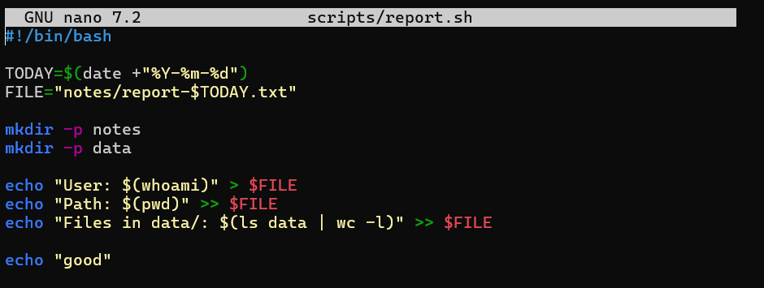
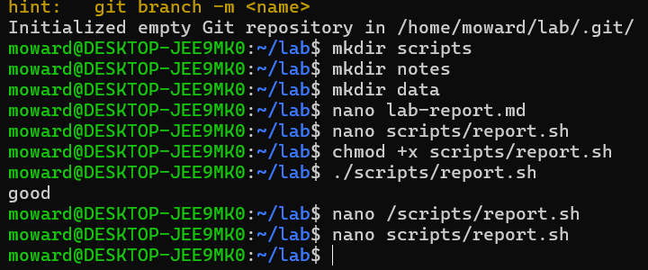
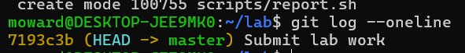

# Lab Report

## 1. أهم الأوامر التي تم تنفيذها
- git init  
- git add .  
- git commit -m "..."  
- git log --oneline  
- ./scripts/report.sh  

---

## 2. صورة شاشة من تنفيذ السكربت  
صورة السكربت:  

تنفيذ السكربت:  

---

## 3. صورة شاشة لسجل Git  

---

# أسئلة التقييم القصيرة

### 1. ما الفرق بين `<` و `<<` و `>>`؟
- `<` يأخذ الإدخال من ملف.  
- `>>` يضيف إلى نهاية الملف.  
- `<<` يُستخدم لما يُعرف بـ here-document.  

### 2. متى نستخدم source ./script.sh بدل ./script.sh؟
عندما نريد تشغيل السكربت في نفس الـ shell، وليس ضمن عملية جديدة.  

### 3. ما الفرق بين `&&` و `||`؟
- `&&` ينفّذ الأمر الثاني إذا نجح الأول.  
- `||` ينفّذ الأمر الثاني إذا فشل الأول.  

### 4. لماذا نستخدم الفروع في Git؟
لتجربة ميزات جديدة دون التأثير على الفرع الرئيسي.  

### 5. ما وظيفة ssh-agent؟
يُستخدم لتخزين مفاتيح SSH في الذاكرة، حتى لا نضطر لإدخال كلمة المرور في كل مرة.